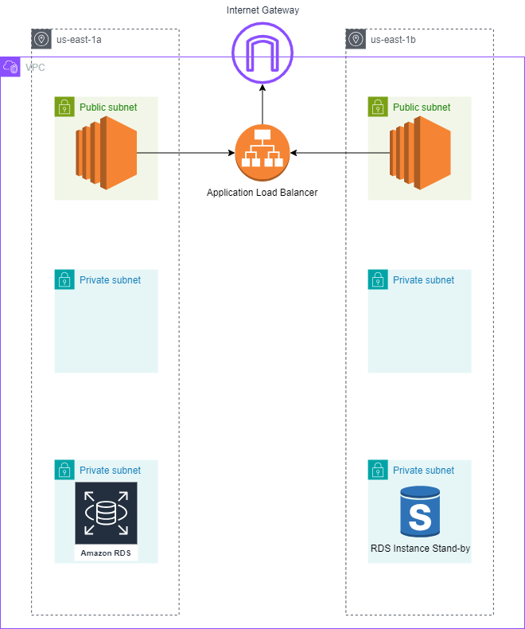

# ThreeTiesrArchitecture

In this project I tried to practice terraform by building a  Three Tier Architecture on AWS.

> [!NOTE]
> The Three Tier Architecture consits of three layers
> - Presentaion Layer (for simplicity i didn't mak ui)
> - Application tier (simple echo commands indicates which server is responding)
> - Data tier (Mysql RDS Instance with active-passive multi-az mode)